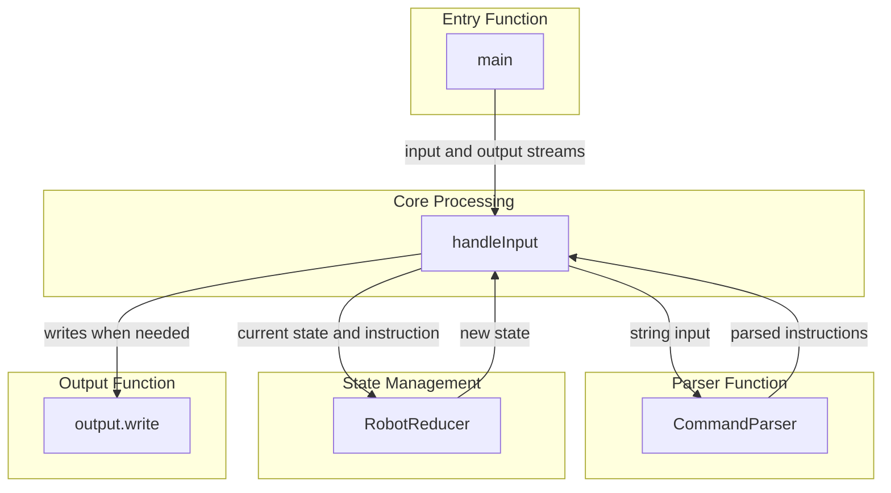
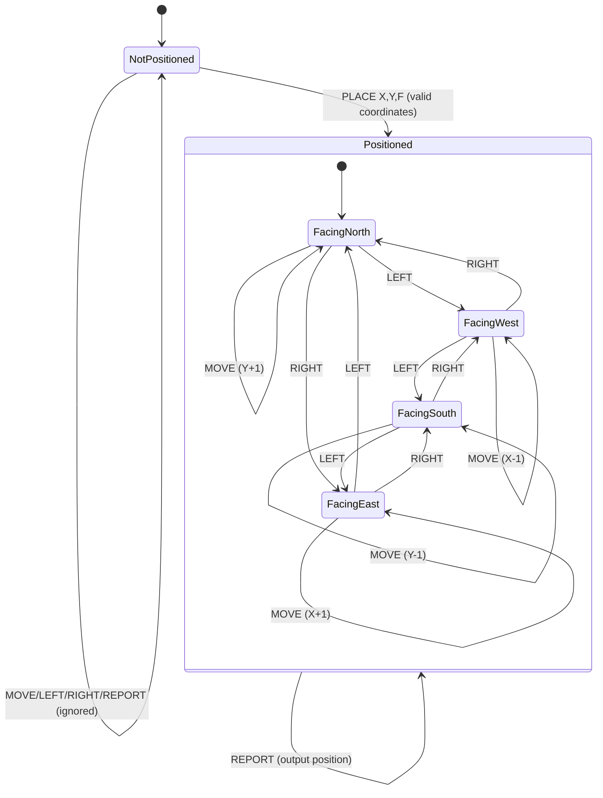

# README

**Author:** Tom Armstrong (hello@tomarmstrong.dev)

## Installation and usage
- `npm install` to install dependencies.
- `npm run build` will bundle the application as a single file in the `/dist` folder.
- `npm run dev` to run the Typescript source in development mode with `tsx`.
- `npm run test` to run the full test suite.

This readme file includes a couple of diagrams in Mermaid format. To view the rendered diagram, you can use the Mermaid website, or a Markdown viewer with Mermaid support. VS Code's "Markdown Preview" function with the Mermaid extension installed works nicely.

## Solution notes

I've implemented this as a NodeJS CLI application written in Typescript.

In terms of the solution design, I've aimed for a functional programming paradigm with Redux-inspired state management, but haven't relied on any external libraries to strictly enforce FP patterns. The main work is done by the `robotEngine` module and its main exported function, which expects a Node `Stream.Readable` and `Stream.Writeable` as its `input` and `output`, respectively. I'm not deeply familiar with Node streams, but I chose them as the basis for this solution because they seemed like suitable and robust built-in abstractions that would allow for the input and output channels to be modified or extended later, and they seemed likely to scale well to handle larger volumes of input in a performant way.

The module implements two custom `Transform` streams, one for parsing the input stream into a stream of command objects, the other to consume those command objects and apply the state reducer function to arrive at the next state. This state is maintained internally in the `StateReducerTransform`, which emits the output as a string when a `REPORT` instruction is received. As mentioned; this isn't strictly functional in its entirety, since both custom transforms extend from Node classes and maintain some internal state, but the reducer for the robot state itself is at least a pure function.

This is wrapped by a `cli` module, which serves as the entry point, and either reads from a file at the provided path, or receives input from STDIN.

### Generating test data

Besides writing the provided samples of known good inputs and expected outputs to text files for use in the tests, I implemented the `generateTestData` module to generate larger volumes to test with.

I considered trying to explore property-based testing approaches, but in the end I opted for two approaches:
- Unit testing to check that individual commands are handled correctly.
- Writing shorter sequences of test inputs and expected outputs that I could verify manually, and then concatenating those sequences together randomly to generate much longer test sequences that I could be sure were correct.

## Notes on my usage of AI

LLM usage wasn't mentioned or prohibited in by the exercise spec, so I did make use of it in this exercise. 
It's use was mostly restricted to generating tests, and functions to generate test data. As a developer, I try to take a carefully considered approach to LLM tools, and I generally prefer to restrict them to more peripheral or shallower parts of the code (eg. tests), to ensure I maintain a deep understanding of the core logic.

That said, relatively late in the time I had available to work on the solution, I did notice an unfortunate defect when handling large volumes of input (eg. input files of 1mb and above), and made use of LLMs to help diagnose and find a solution in the time available.

As I hope is clear: it's my strong desire to be up front about my use of AI tools, and to use them in a responsible way that's in-keeping with my team's policy on these things (whether that's permissive or prohibitive.) I'm happy to elaborate further if desired.

### Limitations and directions for future improvement

There are a few parts of the solution I consider to have room for improvement, which I'll call out here.

- Error handling. The solution doesn't use a dedicated logging library. I realised relatively late that I might have misread the instructions on error handling, and wasn't sure whether the exercise instructions wanted errors to be logged to the terminal or not. As it stands, they're currently written to a log file.
- Performance, and robustness when handling large amounts of input. As mentioned earlier, I realised when I was close to the end of the time I had available that my application wasn't handling large inputs correctly. I believe I've fixed this, but given time, this is something I'd be keen to clean up further.
- Test code. As mentioned, I made substantial use of LLMs to generate the tests that I wanted. I reviewed this code, but I'd like to go over it more closely and perhaps add more extensive testing to ensure the program handles a wide range of malformed inputs.

## Work notes
### Requirements
- Toy robot simulation on a square map; 5x5. Assume the size of the map may be something we might want to change in future.
- Commands to support
  - PLACE X, Y, F
    - F: Facing; NORTH, SOUTH, EAST, WEST
    - Positions the robot at X, Y, facing F
  - MOVE
    - Moves forward in the currently faced direction.
  - LEFT, RIGHT
    - Rotate 90 degrees in the specified direction without position change.
  - REPORT
    - Output the robot's position and orientation.
    - Output how? Stdout?
- A robot not on the table can choose to ignore commands other than PLACE.
- REPORT should not end the session.
- Up to the author how to exit the application. Implies that the application should continue running until forced to quit.
### Assumptions
- "Common issues" mentions performance with large amounts of data, implies it'll be tested for performance with large amounts of data.
- Implied that the format and source of input/output will be changed in the follow up.
### Diagrams

- It should be easy to add more commands.
- It should be easy to change the robot implementation.
- It should be easy to change the output.

### State Diagram

