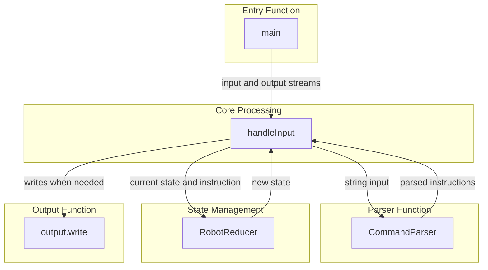
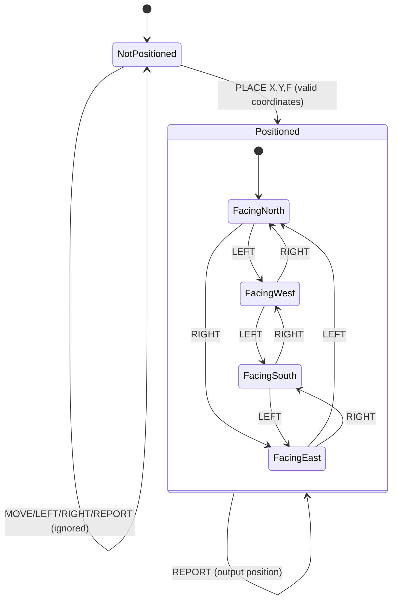

# Exercise notes
## Requirements
- Toy robot simulation on a square map; 5x5. Assume the size of the map may be something we might want to change in future.
- Commands to support
  - PLACE X, Y, F
    - F: Facing; NORTH, SOUTH, EAST, WEST
    - Positions the robot at X, Y, facing F
  - MOVE
    - Moves forward in the currently faced direction.
  - LEFT, RIGHT
    - Rotate 90 degrees in the specified direction without position change.
  - REPORT
    - Output the robot's position and orientation.
    - Output how? Stdout?
- A robot not on the table can choose to ignore commands other than PLACE.
- REPORT should not end the session.
- Up to the author how to exit the application. Implies that the application should continue running until forced to quit.
## Assumptions
- "Common issues" mentions performance with large amounts of data, implies it'll be tested for performance with large amounts of data.
- Implied that the format and source of input/output will be changed in the follow up.
## Notes
### Architecture

- It should be easy to add more commands.
- It should be easy to change the robot implementation.
- It should be easy to change the output.

### State Diagram
